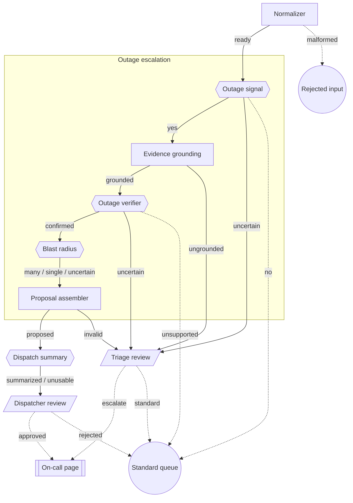

# Example: support-ticket triage from focused objectives

**Status: runnable fixture-only example (2026-09-10).** The graph, contracts,
model bindings, ports, runner, and human decisions below use the package's
public API on the in-memory executable specification. The "model" is a table of
canned answers. No provider, credential, database, or network is involved, and
no timing or accuracy claim is made.

Source:

- [`test/fixtures/mission-pipeline/support-triage-example.mjs`](../test/fixtures/mission-pipeline/support-triage-example.mjs)
  holds the graph, the comparison graph, the fixtures, the ports, the harness,
  and the presentation table.
- [`test/mission-pipeline-support-triage-example.test.mjs`](../test/mission-pipeline-support-triage-example.test.mjs)
  runs every path described here and keeps this page honest, including the
  diagram below, which is derived from the sealed graph and compared verbatim.

Run it:

```sh
npm run build && node --test test/mission-pipeline-support-triage-example.test.mjs
```

The pattern this example applies is explained in
[`GUIDE-FOCUSED-OBJECTIVES.md`](GUIDE-FOCUSED-OBJECTIVES.md).

## The business objective

One question: *does this support ticket need an on-call escalation, and how
urgently?* The answer must be grounded in the ticket text, checked by code, and
proposed to a dispatcher rather than acted on. Any uncertainty must reach a
person with the exact context that produced it. Domain: support tickets, so the
pattern reads as reusable beyond email.

The objective is built from four narrow model judgments, three deterministic
code steps, and two human decisions. Every model invocation is its own node
with its own sealed binding, input contract, outcome vocabulary, attempt
budget, and usage receipt. Nothing hides a second call.

## Diagram

Shapes: rectangle = code, hexagon = model, parallelogram = human. Solid arrows
are sealed edges labelled with the outcomes they carry. Dashed arrows are
declared terminals landing on a presented sink: a double-bordered endpoint
carries a result out of the graph, a circle is a quiet end. The "Outage
escalation" box is a presentation grouping, not an engine concept.



## Nodes

| Node | Kind | Input contract | Outcomes | Attempts | Body |
| --- | --- | --- | --- | --- | --- |
| `normalize` | code | `support-ticket.v1` | `ready`, `malformed` | 1 | Trim, bound the text to 2,000 chars, pin the seed digest as `source`. |
| `outage-signal` | model | `triage-context.v1` | `yes`, `no`, `uncertain` | 2 | "Does this ticket report a service outage or data loss affecting the customer now?" Answer plus quoted evidence. |
| `ground-evidence` | code | `outage-signal.v1` | `grounded`, `ungrounded` | 1 | Every quote must be a literal substring of the normalized text. |
| `outage-verify` | model | `grounded-evidence.v1` | `confirmed`, `unsupported`, `uncertain` | 2 | "Do the quoted spans literally support an active outage?" Sees only grounded evidence. |
| `blast-radius` | model | `outage-verification.v1` | `many`, `single`, `uncertain` | 2 | "Are more than one user or account affected?" Asked only after a confirmed outage. |
| `assemble` | code | `blast-radius.v1` | `proposed`, `invalid` | 1 | Validate the chain, apply the priority policy, assemble the proposal with provenance and a deterministic fallback summary. |
| `summarize` | model | `escalation-proposal.v1` | `summarized`, `unusable` | 2 | One line for the dispatcher. Unusable output falls back to the deterministic line. |
| `dispatch-review` | human | `dispatch-packet.v1` | `approved`, `rejected` | 1 | A dispatcher decides whether to page on-call. |
| `triage-review` | human | `triage-escalation.v1` | `escalate`, `standard` | 1 | Every uncertainty and validator refusal lands here. |

Model bindings: all four model nodes bind the same model revision
(`triage.small-judge@1`) through four distinct sealed bindings. Each binding
embeds its own inference profile with its own `responseContract` and
`maxOutputTokens`, so the graph digest pins exactly which question each call
asks and how much it may generate. The comparison graph adds a fifth binding
with a 512-token budget for the single broad call.

The model port is the one a host writes. It looks up the sealed binding the
node's ref names, builds the provider request with
`modelTurnInvocationRequest` from the input, ref, and context it was handed,
verifies the resolver's capability and prompt identity with
`verifyResolvedModelBinding`, makes the one call, and parses the output into
the node's declared outcome. Only the resolver is a fixture: it answers from
the fixture's canned responses instead of a provider, and logs every request
it receives.

Principals: `triage_worker` executes code and model turns; `triage_console`
records human decisions; `triage_admitter` admits units. The engine rejects a
human decision submitted under the worker principal.

## Goal manifest

The graph has one logical objective, declared in a goal manifest sealed
against the graph digest (`SUPPORT_TRIAGE_GOAL_MANIFEST` in the fixture). The
engine never reads it. Sealing proves from the compiled graph that a unit
entering the goal closes it exactly once, and the test counts closures per
fixture with `projectGoalClosures`.

| Goal | Entry | Members | Closes as `resolved` | Closes as `escalated` |
| --- | --- | --- | --- | --- |
| `outage-escalation` | `outage-signal` | `outage-signal`, `ground-evidence`, `outage-verify`, `blast-radius`, `assemble` | `outage-signal:no`, `outage-verify:unsupported`, `assemble:proposed` | `outage-signal:uncertain`, `ground-evidence:ungrounded`, `outage-verify:uncertain`, `assemble:invalid` |

`blast-radius:uncertain` is not a resolution: it stays inside the goal as an
explicit unresolved fact, and declaring it one fails to seal. The human nodes
are outside the goal; their decisions close the workflow, not the goal. The
overloaded comparison graph seals the same goal with one member, `triage`,
whose `proposed` and `standard` resolve it and whose `uncertain` escalates.

The engine's display projection is available in unreleased 1.1.0. Using the
fixture's exports, a consumer can derive the structure and check that its goal
manifest describes the same exact graph:

```js
import assert from "node:assert/strict";
import { projectGraphDisplay } from "mission-pipeline";
import {
  COMPILED_SUPPORT_TRIAGE_GRAPH,
  SUPPORT_TRIAGE_GOAL_MANIFEST
} from "./test/fixtures/mission-pipeline/support-triage-example.mjs";

const display = projectGraphDisplay(COMPILED_SUPPORT_TRIAGE_GRAPH);
assert.deepEqual({ ...display.graph }, { ...SUPPORT_TRIAGE_GOAL_MANIFEST.graph });
```

`projectGraphDisplay` accepts the original `compileGraph` result from the
same package instance; a transported sealed definition must be compiled again.
Its result carries structural depth, merged arrows, marking nodes, fan-outs,
joins, and terminals. The names and diagram above remain consumer-owned
presentation. The [separate static graphpaper SDK](../packages/mission-pipeline-graphpaper/README.md)
now builds this example's frozen `DiagramModel` in unreleased 0.1.0; browser
adapters and runtime modes in the ADR remain proposed. Golden tests
also compare `graphDefinitionDiff` for the focused and overloaded graphs,
including both exact graph digests.

## Contracts

Each step consumes the exact artifact the previous step emitted. The engine
checks the contract identity of the effective artifact against every target's
declared input at settlement, and each artifact carries `previous`, the content
address of the exact input it was computed from.

| Contract | Produced by | Consumed by | Adds |
| --- | --- | --- | --- |
| `support-ticket.v1` | admission (seed) | `normalize` | `ticketId`, `product`, `customerTier`, `subject`, `body`, `openedAt` |
| `triage-context.v1` | `normalize` | `outage-signal` | `ticket`, bounded `text`, `source` = seed ref |
| `outage-signal.v1` | `outage-signal` on `yes`/`no` | `ground-evidence` | `signal.answer`, `signal.evidence[].quote`, `signal.previous` |
| `grounded-evidence.v1` | `ground-evidence` on `grounded` | `outage-verify` | `grounding.quotes[].offset`, `grounding.previous` |
| `outage-verification.v1` | `outage-verify` on `confirmed`/`unsupported` | `blast-radius` | `verification.verdict`, `verification.previous` |
| `blast-radius.v1` | `blast-radius` on every outcome | `assemble` | `blastRadius.answer`, `blastRadius.usable`, `blastRadius.previous` |
| `escalation-proposal.v1` | `assemble` on `proposed` | `summarize` | `priority`, `blastRadius`, `evidence`, `fallbackSummary`, `provenance.seed`, `provenance.steps[]` |
| `dispatch-packet.v1` | `summarize` on both outcomes | `dispatch-review` | `proposal`, `summary.text`, `summary.source` = `model` or `deterministic` |
| `triage-escalation.v1` | any step on its uncertain, ungrounded, or invalid outcome | `triage-review` | `step`, `reason`, `detail`, `input` ref, carried `context` |

Two contract facts shape the graph:

- A human node has exactly one input contract, so every escalation source
  emits the same `triage-escalation.v1` artifact on its escalating outcome and
  a different contract on its ordinary outcome. Every code and model node
  declares `outputs` per outcome, so `compileGraph` proves each escalating
  outcome lands on the human node's contract and each ordinary outcome on its
  successor's, and a body that returns anything else is refused before its
  completion is cached. The human nodes leave their outputs undeclared: their
  decisions carry the packet forward unchanged.
- The `assemble` node pins `configuration: triage.priority-policy@1`, whose
  digest is the digest of the sealed policy object. The body refuses to run
  under any other ref, so a rule change is a new policy version, a new graph
  digest, and new attempt keys, never a silent edit.
- `blast-radius` carries `uncertain` forward as an explicit fact instead of
  escalating, because the downstream decision tolerates it: the assembler
  records `blastRadius: "unresolved"` and priority `p2`, and the dispatcher sees
  that the fact is unresolved. Nothing defaults an unknown to a lower class.

## Fixtures and expected paths

| Fixture | Ticket | Model answers | Journey | Ends |
| --- | --- | --- | --- | --- |
| `positive` | enterprise: "none of our 40 agents can log in… API returns 503" | signal `yes` with a literal quote; verify `confirmed`; blast `many`; summary usable | `normalize:ready`, `outage-signal:yes`, `ground-evidence:grounded`, `outage-verify:confirmed`, `blast-radius:many`, `assemble:proposed`, `summarize:summarized` | queued at `dispatch-review` with a `p1` packet; the test records `approved` |
| `negative` | free: dark-mode feature request | signal `no` | `normalize:ready`, `outage-signal:no` | quiet end after one model call; the `no` judgment is still retained as evidence |
| `ambiguous` | business: "things seem slow… sometimes pages do not load" | signal `uncertain` | `normalize:ready`, `outage-signal:uncertain` | queued at `triage-review` with reason `uncertain_answer` and the exact context digest; the test records `standard` |
| `fabricated-evidence` | business: "export failed once last week" | signal `yes` quoting text the ticket does not contain | `normalize:ready`, `outage-signal:yes`, `ground-evidence:ungrounded` | queued at `triage-review` with reason `ungrounded_evidence` and the missing quote; the verifier never runs |
| `provider-outage` | enterprise: same text as `positive` | the model port throws a retryable failure on every attempt | `normalize:ready`, `outage-signal!dependency_unavailable:retry`, `outage-signal!dependency_unavailable:terminal` | dead letter at `outage-signal`; no successor, no human fallback, no usage recorded |
| `unusable-summary` | business: "our whole team cannot log in" | verify `confirmed`; blast `uncertain`; summary empty | …`blast-radius:uncertain`, `assemble:proposed`, `summarize:unusable` | queued at `dispatch-review` with `summary.source: "deterministic"`, `blastRadius: "unresolved"`, priority `p2` |

Model calls per path are structural facts of the graph, not measurements:
one call for a negative or an uncertain first answer, two through the
verifier, four for a full positive path. Token counts in the fixtures are
illustrative fixture data and prove only that every model attempt appends one
usage receipt to the outbox.

The `assemble:invalid` outcome is declared, routed to `triage-review`, and
reached by no fixture. It is a corruption defence: the engine's contract and
digest checks make the inputs it guards against unreachable today, and the
compiler refuses the graph if the route is removed. "Never observed" is not
"unreachable"; the outcome stays declared and the picture shows it.

## What the test proves

- The graph compiles: nine nodes, eleven edges, seven terminals, every declared
  outcome routed or terminal. Removing the `assemble:invalid` route, or
  replacing the `signal-uncertain` edge with a conditional `where` arm, fails
  compilation with the exact node and outcome named.
- Each path above, verbatim, from the journey records; the queued human node
  and its input contract; the escalation artifact's step, reason, and exact
  input digest; the proposal's provenance chain back to the seed digest.
- Bounded retries: the provider-outage fixture fails attempt 1 as retryable,
  attempt 2 as terminal, appends one dead letter, routes nowhere, and records no
  usage because a thrown error carries no receipt.
- Usage accounting: one `node_turn_usage_receipt` outbox event per model
  attempt, none for code or human turns; journey usage matches node kind.
- A body can be unit-tested against its sealed node with
  `validateNodeTurnCompletion` and no store.
- Replay: running the same fixture in a fresh store yields identical journey
  record digests, and the admission pins the graph digest.
- Human decisions settle under the console principal with actor attribution
  and route or terminate exactly as declared.
- The presentation table covers the sealed graph exactly, the coverage check
  bites on four kinds of drift, and the diagram above equals the renderer's
  output for the current definition.
- Declared outputs: a wrong declaration on the `signal-uncertain` route fails
  compilation naming the edge, the contract, and the target; a body returning
  the wrong contract is refused by `validateNodeTurnCompletion`.
- The pinned policy: the same graph with a different `assemble` configuration
  digest is a different graph and fingerprint, and the assembler dead-letters
  on its first attempt with `immutable_configuration_rejected`.
- The goal manifest seals against the exact graph, and the check bites:
  dropping `assemble:proposed` names the edge that leaves the goal without a
  resolution, dropping `outage-signal:no` names the terminal without one, and
  a new `assemble` outcome must be classified before the manifest re-seals.
- Every fixture closes the goal exactly once, or dies inside it: `positive`
  and `unusable-summary` by `assemble:proposed` after five turns and three
  receipts; `negative` by `outage-signal:no`; `ambiguous` and
  `fabricated-evidence` by an escalation; `provider-outage` dies at
  `outage-signal` with no closure and no receipt. The overloaded graph closes
  the same goal in one turn every time.
- The provider boundary receives the journey's own attempt identity: every
  request the fixture resolver logged carries the unit id, queue id, node ref,
  attempt numbers, idempotency key, and input digest of the settled turn, and
  the provider-outage retry is a second request at the same queue occurrence
  with a new key.

## The overloaded alternative

`SUPPORT_TRIAGE_MONOLITH_GRAPH` answers the same objective with one broad
model node, `triage`, whose response carries `outage`, `blastRadius`,
`priority`, `summary`, `confidence`, and `category`. Its port validates the
wide payload, applies a confidence bar of 0.7 that lives only in code, and
assembles the dispatch packet in the same turn. The test runs it on the same
fixtures.

| Aspect | Focused graph | Single broad call |
| --- | --- | --- |
| Model calls, positive path | 4 short calls, each re-sending the context | 1 call generating the whole payload |
| Model calls, negative path | 1 | 1, but still generating summary, priority, and category nobody reads |
| Fabricated evidence | Caught by deterministic grounding; the verifier never runs | Invisible: nothing grounds a quote, so the ticket is proposed for escalation |
| Where policy lives | `assemble` (priority) and the graph (routing); visible in the picture and testable in isolation | inside the port; the graph shows one node and cannot show the bar |
| What evidence retains | one artifact per judgment with its own receipt and exact input | one artifact for everything; one wrong field taints the record |
| Changing one question | new binding for one node, new graph version | new response contract, prompt, and port for everything |
| Evaluation | each question has its own positive/negative denominators | one accuracy number over a bundle |
| Cost and latency | more prefill work and more turns; may be slower on one serialized GPU | fewer turns; longer generation; a bigger model may be needed to hold six answers at once |
| Uncertainty | a declared outcome per question, carried or escalated explicitly | one confidence number for six answers |

Neither column is universally better. The focused graph buys testability,
evidence, and selective execution at the price of repeated context and more
turns. Whether it is faster or cheaper on a given model and host is a
measurement, not a property of the shape. The guide's assessment section says
what to measure.

## What this example does not exercise

- Joins. The graph has no fan-out that must be synchronized, because every
  successor consumes exactly one predecessor's output. The guide documents the
  engine's actual join semantics and a valid join example.
- Callback and agent nodes. Timers and external events are `callback` nodes;
  the engine has no timeouts of its own.
- Outbox effects beyond usage receipts. A consumer would map `dispatch-review:
  approved` to an outbox event for a paging relay in the settlement transaction;
  the example keeps effects out.
- A real provider. The resolver is a fixture; the call path in front of it,
  from binding ref to verified `invoke`, is the real one.

## Adapting it

Copy the fixture module, replace the contracts and bodies, keep the harness.
Add one fixture per path you claim exists. Keep the presentation table next to
the graph and let the coverage test fail when the definition changes without
its words.
