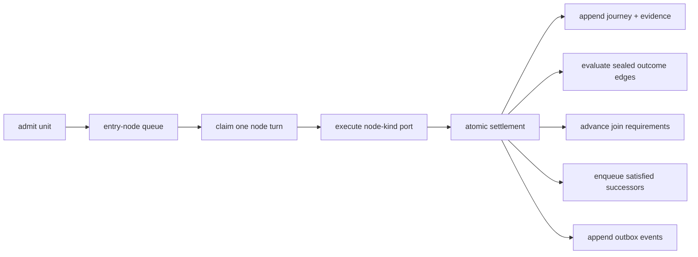

# Switchyard engine guide

The Switchyard runtime has one durable position model: a unit journey
projected into literal per-node queues.

The graph compiler is the load-bearing publication guard. Every outcome of
every node must have a deterministic route or an explicit terminal declaration.
Reachability, bindings, predicates, and joins are checked before a graph can be
published.

The memory graph/unit stores are the executable specification. Consumer stores
run the same conformance suite, including all settlement crash checkpoints.
Before commit, a unit remains claimable at its current node; after commit, it
is fully settled and queued at every satisfied successor. No intermediate
position is observable.

See the [ratified design](DESIGN-NODE-GRAPH-V2.md) for semantics and the
[phase plan](PLAN-NODE-GRAPH-V2.md) for executable evidence. Both are dated
records written before the 2.0.0 rename and use the 1.x names; `CHANGELOG.md`
maps them to the current ones.
