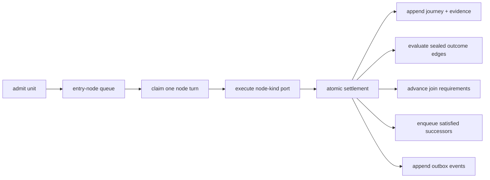

# Switchyard engine guide

The Switchyard runtime has one durable position model: a unit journey
projected into literal per-node queues.

The graph compiler is the load-bearing publication guard. Every outcome of
every node must have a deterministic route or an explicit terminal declaration.
Reachability, bindings, predicates, and joins are checked before a graph can be
published.

The memory graph/unit stores are the executable specification. Consumer stores
run the same conformance suite, including all settlement crash checkpoints.
Before commit, a unit remains claimable at its current node; after commit, it
is fully settled and queued at every satisfied successor. No intermediate
position is observable.

See the [ratified design](DESIGN-NODE-GRAPH-V2.md) for semantics and the
[phase plan](PLAN-NODE-GRAPH-V2.md) for executable evidence. Both are dated
records written before the 2.0.0 rename and use the 1.x names; `CHANGELOG.md`
maps them to the current ones.
[phase plan](PLAN-NODE-GRAPH-V2.md) for executable evidence.

## Building pipelines from focused objectives

Application guidance for consumers that split broad model nodes into small,
independently testable steps. Each document says what exists, what is a
recommended pattern, and what is only proposed.

- [Guide: focused objectives](GUIDE-FOCUSED-OBJECTIVES.md) explains how to
  recognize an overloaded node, when to separate objectives or keep a
  multiclass step, how goals relate to steps and validators, how uncertainty
  and failures are preserved, how identities version independently, and how to
  assess a complete workflow without promising speedups.
- [Example: support-ticket triage](EXAMPLE-SUPPORT-TRIAGE.md) is a runnable
  fixture-only workflow on the memory store, with its diagram, contract table,
  fixtures, expected paths, and a comparison against one overloaded call.
  Source: `test/fixtures/switchyard/support-triage-example.mjs` and
  `test/switchyard-support-triage-example.test.mjs`.
- [Review: interface friction](REVIEW-INTERFACE-FRICTION.md) records what the
  API does today, states join semantics exactly, and lists prioritized
  proposals (problem, workaround, interface, compatibility, tests), marking
  the ones implemented in 2.1.0: unit-path projection, turn budget, code port
  by node, declared output contracts, the node configuration ref, and the
  goal manifest with its closure projection, and model turn invocation
  request. The closing section records the remaining engine display/diff
  projections implemented in 2.1.0. P7 join envelopes and P8
  declared-failure policies were subsequently implemented at the user's
  request; their [contract and verification record](IMPLEMENTED-P7-P8.md)
  distinguishes local implementation from downstream adoption. The historical
  P8 assessment remains evidence of missing independent consumer agreement.
- [ADR: graphpaper frontend SDK](ADR-GRAPHPAPER-FRONTEND-SDK.md) proposes a
  framework-independent viewer package between this engine and graphpaper,
  with ownership boundaries, contracts, a consumer integration sketch, and an
  extraction plan. Engine extraction is complete in 2.1.0,
  including `projectGraphDisplay` and `graphDefinitionDiff`. The
  [static SDK](../packages/switchyard-graphpaper/README.md) is
  implemented as a separate in-repository package, version 0.1.0 unreleased;
  it includes server figures/assets and browser selection, deep links, and an
  authorized details seam. Automated checks and a [local Browser witness](VERIFY-GRAPHPAPER-STATIC-ADAPTERS.md)
  cover ELK, mouse/keyboard, details races, deep links, responsive layout, and
  teardown; reduced-motion activation remains unverified. Runtime modes,
  viewer updates, goal scopes, and Inbox adoption remain proposed; no
  merge-readiness or deployed-consumer claim follows.
- [Workflow: a graph change includes its picture](WORKFLOW-GRAPH-CHANGES.md)
  states the expectation that presentation, examples, and verification land
  with every definition change, and the checks that prove it.
