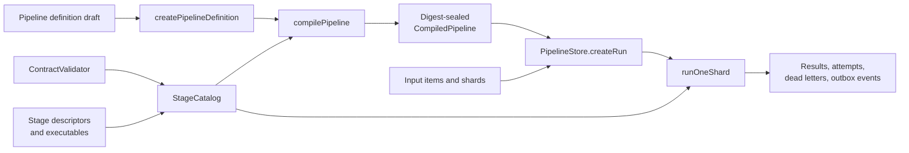

# Building pipelines

Mission Pipeline treats a pipeline as a static, versioned directed acyclic
graph (DAG). A host application supplies the contracts and stage code; the
engine checks the wiring, seals the resulting definition, and executes the
compiled graph durably.

## The assembly model



There are four pieces to put together:

1. **Contracts** name and validate the payloads crossing every edge. Contract
   IDs use the `<name>.v<number>` form, such as `order.v1`.
2. **Stages** describe one unit of work. The descriptor declares its kind,
   input slots, output contract, capabilities, version, and delivery semantics.
   The executable supplies the implementation or the identity used by an
   injected non-code invoker.
3. **Nodes** place registered stages in a graph. A node input reads either the
   pipeline input or the output of another node.
4. **A run** pins one compiled graph, a set of input items, and a partition of
   those items into shards. Workers claim and process at most one shard per
   `runOneShard` call.

The distinction between a stage and a node is useful: a stage is a reusable,
versioned operation, while a node is one use of that operation in a particular
graph. Two nodes can use the same stage without sharing an execution identity.

## Examples

- [Linear code pipeline](examples/linear-code-pipeline.md) builds and runs a
  complete two-stage pipeline with the in-memory store.
- [Branch-and-join pipeline](examples/branch-and-join-pipeline.md) fans one
  artifact into two branches and joins the results through named input slots.

Both pages have runnable companion files. From the repository root, run either
example:

```sh
node docs/examples/linear-code-pipeline.mjs
node docs/examples/branch-and-join-pipeline.mjs
```

## Node kinds

| Kind | Where execution comes from | Binding rule |
| --- | --- | --- |
| `code` | The registered executable's `run()` method | No binding |
| `model` | A configured `NodeInvoker`, normally `createModelNodeInvoker` | Requires a digest-sealed model binding ref |
| `agent` | A configured `NodeInvoker`, normally `createAgentNodeInvoker` | No pipeline-node binding |
| `gate` | A configured gate invoker | Requires a decision binding ref and must be a terminal pipeline output |

Start with `code` stages when learning the assembly model. Model, agent, and
gate nodes use the same graph wiring but add their respective resolver,
executor, receipt, or decision-flow configuration.

## Wiring rules worth remembering

- A node must supply exactly the input slot names declared by its stage.
- The source artifact's contract must equal the receiving slot's contract.
- A source node must exist, and the graph must not contain a cycle.
- Every declared pipeline output must name a node in the graph.
- A one-slot stage receives the artifact value directly. A multi-slot stage
  receives an object keyed by slot name.
- Version `0.2` executes only `at_least_once_idempotent` nodes. Use the
  attempt context's stable `idempotencyKey` for external side effects.
- Definitions and compiled pipelines are digest-sealed. Publish a new version
  instead of mutating a published definition.

`compilePipeline` checks the topology, slot names, contracts, registrations,
bindings, and gate terminality before a run can invoke a stage. Treat compiler
errors as assembly feedback: they identify the node and edge that do not fit.
